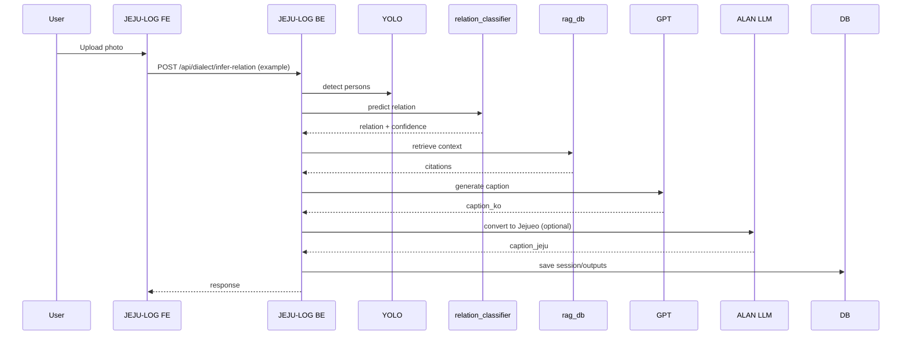

# JEJU-LOG — 제주 여행을 “기억 가능한 스토리”로 바꾸는 AI 포토부스

제주에서 찍는 사진은 많지만, “이 순간을 이야기로 남기는 경험”은 부족합니다.  
**JEJU-LOG**는 포토부스 + AI로 사진 속 맥락(관계/날씨/시간/관광지)을 결합해 **스토리텔링 문구**를 생성하고, **제주어 톤 변환**, **다국어 지원**, **여행일지 생성**까지 이어지는 기록 경험을 제공합니다.

---
---

## 사용법(Quick Start)

### 1) GitHub에서 프로젝트 받기
처음 받는 경우(클론):
```bash
git clone <YOUR_REPO_URL>
cd <REPO_DIR>
```

이미 클론해둔 경우(최신으로 받기):
```bash
git pull
```

> `<YOUR_REPO_URL>` / `<REPO_DIR>`는 본인 레포 정보로 바꿔서 사용하세요.

### 2) 필수 툴 설치(로컬 개발 환경)
- **Git**: 설치 후 `git --version` 확인
- **Node.js**: (권장) LTS 버전 설치 후 `node -v`, `npm -v` 확인  
  - Windows/macOS: 공식 설치 프로그램 사용  
  - macOS/Linux: (선택) `nvm`으로 설치/버전 관리
- **Python**: 프로젝트에 맞는 버전 설치 후 `python --version` 확인  
  - Windows: 공식 설치 프로그램 사용(“Add Python to PATH” 체크 권장)  
  - macOS/Linux: (선택) `pyenv`로 설치/버전 관리
- **DB**
  - 현재 README 기준: **SQLite3** 사용(별도 설치 없이 Django로 사용 가능)
  - TODO: **PostgreSQL** 전환 시 로컬 설치 + 계정/DB 생성 필요

### 3) 환경변수(.env) 설정
`.env.example`을 참고해 `.env`를 생성하고, **본인 API KEY**를 입력하세요.

- 백엔드(`server/`)에서 읽는 키:
  - `OPENAI_API_KEY` (문구/일지 생성)
  - `ALAN_CLIENT_ID` (제주어 변환)
- 프론트엔드(`client/`)에서 쓰는 키/설정:
  - `VITE_API_BASE_URL` (백엔드 주소)

> ⚠️ `.env` 파일은 **절대 GitHub에 커밋하지 마세요.** (gitignore 필수)

### 4) Backend 실행 (Django)
```bash
cd server
python -m venv .venv

# Windows
.venv\Scripts\activate
# macOS/Linux
# source .venv/bin/activate

pip install -r requirements.txt
python manage.py migrate
python manage.py runserver
```

### 5) Frontend 실행 (React)
```bash
cd client/JEJULOG-FE
npm install
npm run dev
```

### 6) 정상 동작 확인
- 프론트에서 요청이 백엔드로 잘 가는지 `VITE_API_BASE_URL` 값을 확인하세요.
- 기본 백엔드 주소: `http://localhost:8000`

---


## 실행 방법 (상세, 프론트/백 분리)

### 요구사항(Prerequisites)
- Node.js: **TODO**
- Python: **TODO** (현재 로컬에서 `3.14.x` 사용 중)
- DB:
  - 현재: **SQLite3**
  - TODO: PostgreSQL 전환 시 `DATABASE_URL` 및 Django settings 변경

### 환경변수
`.env.example` 참고 후 `.env` 생성

```env
# Django
SECRET_KEY=django-insecure-change-me-in-production
DEBUG=True

# AI API Keys
OPENAI_API_KEY=
ALAN_CLIENT_ID=
ALAN_BASE_URL=https://kdt-api-function.azurewebsites.net

# Frontend API base
VITE_API_BASE_URL=http://localhost:8000

# Dataset Path (optional)
# DATASET_DIR=D:/relation_dataset/train
```

### DB 준비
현재 SQLite3 사용

```bash
cd server
python manage.py migrate
```

### Backend 실행
```bash
cd server
python -m venv .venv
# Windows
.venv\Scripts\activate
# macOS/Linux
# source .venv/bin/activate

pip install -r requirements.txt
python manage.py runserver
```

### Frontend 실행
```bash
cd client/JEJULOG-FE
npm install
npm run dev
```

### AI 모델/가중치
- YOLO: `models/yolov8n.pt`
- 관계 모델: `server/models/relation_classifier.pt`
- TODO: 관계 모델 재학습 시 `server/tools/train_relation_classifier.py` 실행

### 연동 확인
- `VITE_API_BASE_URL`가 백엔드 URL과 일치하는지 확인
- 기본: `http://localhost:8000`

---

## 기획/배경

### 문제 정의
- 제주 인증 관광은 늘었지만, 기념품은 남아도 **스토리는 약합니다**.
- 즉석 사진/굿즈는 많지만 **개인적인 맥락(관계·순간·장소)**이 반영된 기록은 드뭅니다.

### 왜 포토부스 + AI인가?
- 포토부스는 여행 흐름을 해치지 않고 **즉시 사용 가능한 물리적 경험**입니다.
- AI는 사진 + 관계 + 시간/날씨 + 관광지 정보를 결합해 **개인화된 스토리**를 생성할 수 있습니다.
- 결과적으로 “기념품”을 넘어 “기억의 기록물”로 확장됩니다.

---

## 해결책 요약
- **스토리텔링 문구 생성**: 사진 + 관계 + 해시태그 + 관광지 RAG 기반
- **제주어 톤 변환**: 표준어 → 제주어(방언)로 *의미 보존* 변환
- **RAG 근거 제공**: 관광지 문서를 근거로 문구 생성(환각 방지 방향)
- **다국어 지원**: HuggingFace 번역 모델 기반
- **앱 여행일지**: 일정 기간의 기록을 요약한 여행일지 생성

---

## 주요 기능 (Feature List)
- **F1** 다국어 번역 (HuggingFace)
- **F2** 관계 추론 (YOLO bbox + 관계 분류 모델)
- **F3** 관계+관광지 기반 해시태그 추천
- **F4** 문구 생성 (GPT + RAG 컨텍스트 통합)
- **F5** 제주어 변환 (ALAN LLM)
- **F6** 기간 일지 생성 (GPT 기반 요약)

기능 명세서: `docs/spec/functional-spec.md`

---

## AI 기능 상세

> 각 기능마다 **왜 필요한지 / 어떻게 동작하는지 / 입력·출력 예시 / 실패·폴백**을 포함합니다.

### F1. 다국어 번역 (HuggingFace M2M100)
**왜 필요한지**  
외국인 관광객과 SNS 공유를 위한 다국어 문구 지원.

**어떻게 동작하는지**
- HuggingFace **M2M100** 모델 사용(예: ko → en/ja/zh)
- (선택) 입력 언어 감지 후 목적 언어로 변환

**입력/출력 예시**
- 입력: `성산일출봉에서 맞이한 아침`
- 출력: `A morning welcomed at Seongsan Ilchulbong`

**실패/폴백**
- 모델 실패 시: 친화 메시지 + 원문 반환  
  - TODO: 실패/타임아웃 정책 문서화

---

### F2. 관계 추론 (YOLO bbox + 관계 모델)
**왜 필요한지**  
관계(혼자/커플/친구/가족)는 문구/해시태그/톤의 핵심 조건입니다.

**어떻게 동작하는지**
1. YOLO로 사람 bbox 추출
2. bbox 통계/분포 특징(예: 24차원) → MLP 분류기
3. confidence 산출, 예외 시 `unknown` 처리

**입력/출력 예시**
- 입력: 이미지 1장
- 출력:
  ```json
  { "relation_label": "couple", "confidence": 0.82, "person_count": 2 }
  ```

**실패/폴백**
- 사람 미검출 → `unknown`
- 모델 미로딩 → 사람 수 기반 규칙 분류(간단 폴백)

---

### F3. 해시태그 추천 (관계 + 관광지)
**왜 필요한지**  
SNS 공유 최적화 + 검색성과 확장성 확보.

**어떻게 동작하는지**
- 관계 + 장소 기반 규칙 조합
- (옵션) LLM 보강  
  - TODO: 실제 적용 여부/정책 명시

**입력/출력 예시**
- 입력: `relation=couple, place=성산일출봉`
- 출력:
  ```json
  ["#제주", "#성산일출봉", "#커플여행", "#일출", "#힐링"]
  ```

**실패/폴백**
- 장소 미확인 시: 일반 제주 태그 세트 반환

---

### F4. 문구 생성 (GPT + RAG 컨텍스트)
**왜 필요한지**  
“사진 한 장”을 “의미 있는 기록”으로 변환하는 핵심 기능.

**어떻게 동작하는지**
1. 관광지 RAG 문서 Top-K 검색
2. 관계/날씨/시간/해시태그/모드 결합 프롬프트 구성
3. GPT로 문구 생성
4. 근거(citations) 저장

**입력/출력 예시**
- 입력: `photo, place=성산일출봉, relation=solo, hashtags, mode=조언`
- 출력:
  ```json
  {
    "caption_text": "새벽 공기 속 성산일출봉은 마음을 잠시 멈추게 했다. 가끔은 멈춰서 숨을 고르는 것도 여행이다.",
    "citations": [{ "doc_id": "..." }]
  }
  ```

**실패/폴백**
- RAG 결과 없음 → 기본 제주 서정 템플릿 사용
- LLM 실패 → 고정 템플릿 문구 반환

---

### F5. 제주어 변환 (ALAN LLM)
**왜 필요한지**  
제주 로컬 경험의 깊이를 강화하고 관광 기억을 지역성 있게 표현.

**어떻게 동작하는지**
- ALAN LLM에 표준어 입력
- 의미 보존 + 고유명사 유지
- (옵션) 강도 조절  
  - TODO: 강도 파라미터 정교화

**입력/출력 예시**
- 입력: `성산일출봉에서 바람이 참 좋았다`
- 출력: `성산일출봉서 바람 진짜 좋앗주게`

**실패/폴백**
- 변환 품질 저하 시 원문 반환

---

### F6. 기간 여행일지 생성 (GPT)
**왜 필요한지**  
여행을 타임라인 기반의 기록물로 남기기 위함.

**어떻게 동작하는지**
1. DB에서 기간 내 `photo/caption/metadata` 조회
2. 날짜/장소별 요약 구성
3. GPT로 일지 템플릿 생성

**입력/출력 예시**
- 입력: `user_id, date_from, date_to`
- 출력: `title, body, entries`

**실패/폴백**
- 기간 내 데이터 없음 → “기록 없음” 메시지 반환

---

## 지속 확장형 모델/서비스 구조

JEJU-LOG는 사용 과정에서 다음 데이터가 축적됩니다:
- 사진 메타 / 관계 라벨 / 문구 결과 / 사용자 선택(모드/재생성/선호) / 관광지 문서

이를 통해:
- 해시태그/문구 품질 개선
- 관계 모델 재학습
- RAG 지식 확장
- 사용자 취향 반영(옵션)

→ **지속적으로 품질이 향상되는 구조**를 지향합니다.

---

## 아키텍처

### (A) 시스템 컴포넌트 다이어그램
```mermaid
flowchart LR
  Client[JEJU-LOG Frontend (React)]
  Server[JEJU-LOG Backend (Django)]
  DB[(DB: SQLite3 / TODO: PostgreSQL)]
  AI[AI Modules]
  Ext[External APIs]

  Client -->|REST API| Server
  Server --> DB
  Server --> AI
  AI --> Ext

  AI -->|F1 번역| HF[HuggingFace M2M100]
  AI -->|F4 문구| GPT[OpenAI GPT]
  AI -->|F5 제주어| ALAN[ALAN LLM]
  AI -->|F2 관계| YOLO[YOLOv8]
```

### (B) 핵심 시퀀스 다이어그램


> 참고: 위 엔드포인트는 README 예시입니다. 실제 경로는 코드 기준으로 수정하세요. (TODO)

---

## TODO / 한계 및 향후 개선
- 배포 미완(컨테이너/서버리스 등)
- PostgreSQL 전환 및 마이그레이션 정리
- RAG 문서 업로드/관리(관리자 모드/인덱싱) 명세 및 구현 보강
- 관계 추론 성능 개선(데이터 확장/증강/학습/검증 자동화)
- LLM 비용/지연 최적화(캐시/리트라이/폴백 정책)
- 개인정보(이미지) 저장/삭제 정책 명문화 및 적용
